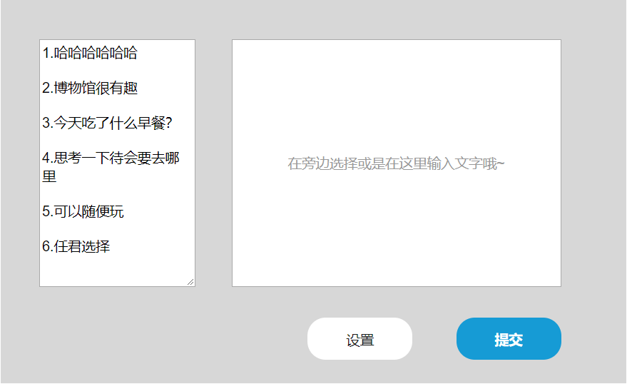
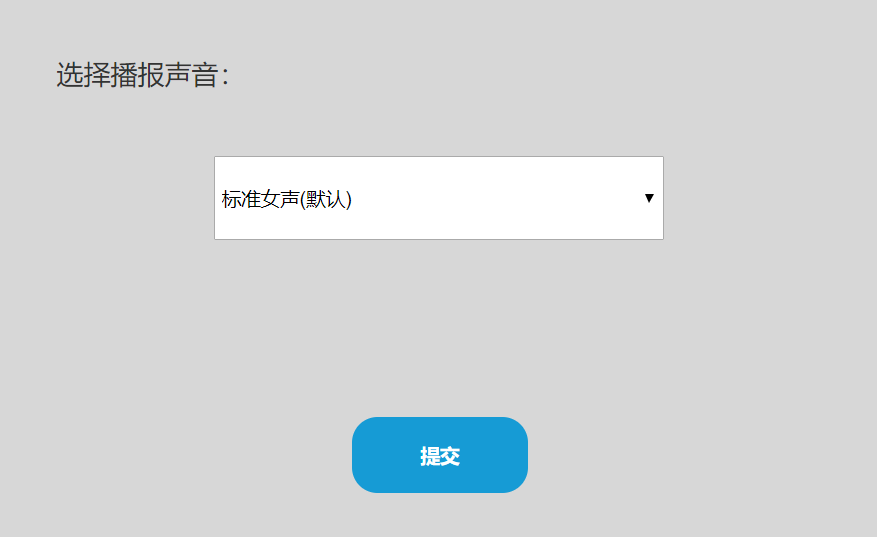
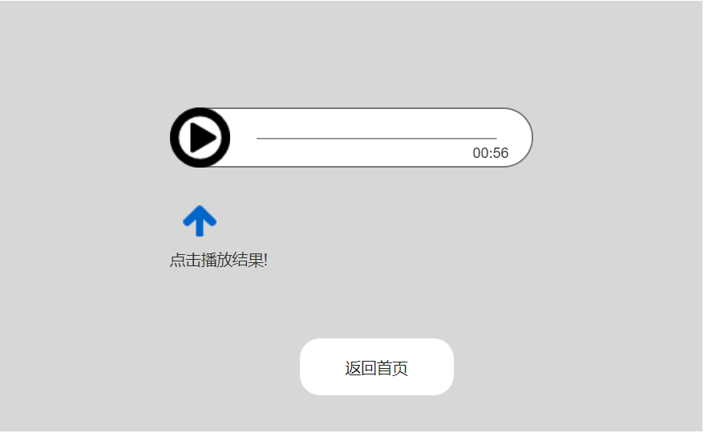
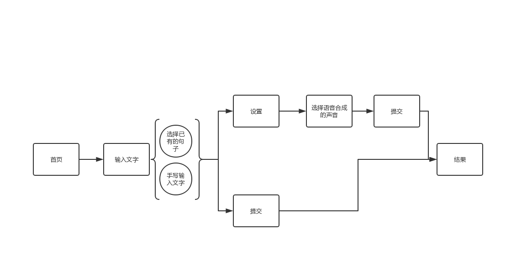

# 博物馆

面对人群：多动症患者

## 一、PRD价值主张设计

### PRD1.加值宣言

- 通过 **人体检测** 识别多动症患者后带他们到博物馆中一个专为他们而设的活动区域。再通过**语音合成**技术的活动使多动症人群用户沉浸在特色语音的魅力中。

### PRD2.核心价值

1.  将文字信息转化为声音信息
2.  让目标人群游客体验科技合成声音信息所传递的魅力
3.  通过人体检测识别出多动症人群，在特定区域内活动有利于他们本身知识吸取及不会干扰到其他游客

### PRD3.核心价值&用户痛点

1.  多动症人群无法安静集中一段时间，有可能会打扰到别的游客获取博物馆中的知识。
- 将他们安排到特定活动区域有利于集中他们的注意力，若是在普通场馆和其他游客待在一起一方面目标人群有可能无所适从，另一方面有可能会干扰到别的游客，

2.  对博物馆某些场馆或活动适应不良，情绪易波动
- 语音合成有着多样的声音选择，可吸引目标人群的注意力。在特定区域内也不会有其他人打扰到目标人群的使用，而目标人群也没有需要排队等等容易不耐烦的困扰。

### PRD4.人工智能概率性与用户痛点

1.  人体检测可能检测不到所有的目标人群患者，例如一些动作没那么大、反应没那么强烈的患者。
-  * _如何解决？_

     检测不到的情况下当作普通游客看待，标记出有可能是目标人群的游客，当他们有过度行为时再进一步带他们到特定区域。

2. 合成需要用户输入一定的文字才能转化为声音反馈，对于多动症患者来说操作比较繁琐。
- * _如何解决？_

     可以在一旁有现成的几句文字供目标人群选择使用，直接就可以转成语音反馈出来。

### PRD5.需求列表与人工智能API加值

| Behavior                       | Issue                            | API      |
| ------------------------------ | -------------------------------- | -------- |
| 通过监控监测动作反应异常的游客       | 不能百分百监测到多动症患者           | 人体检测 |
| 文字通过声音反馈       | 有可能会打错字导致语义不通顺 | 语音合成 |

## 二、原型

### 原型1.交互及界面设计

1. 首页：用户在此页面进入语音合成功能页面

2. 输入文字页面：针对多动症患者，我们在页面左侧设置已有的句子供他们选择使用，减少注意力不集中问题；右侧也可让他们直接打字输入。若在此页面直接提交，返回的结果是默认的标准女声。

3. 设置：在此页面用户可是设置想要合成的声音

4. 提交成功：此页面是提交后的语音合成结果显示，可返回首页无限次使用。

### 原型2.信息设计

### 原型3.原型文档

- [产品原型交互](http://nfunm071.gitee.io/api_museum_individual)

## 三、API 产品使用关键AI或机器学习之API的输出入展示

### API1.使用水平

| 输入                       | 输出                            | API      |
| ------------------------------ | -------------------------------- | -------- |
| 用户输入文字      | 声音反馈出文字内容           | 百度语音合成 |
| 用户输入文字       | 声音反馈出文字内容          | 腾讯语音合成 |
| 检测传入的图片中的人体   | 异常人群检测           | 百度人体检测 |
| 检测传入的图片中的人体   | 异常人群监测          | 旷视Face++人体检测 |

### API2.使用比较分析

- [百度、阿里语音识别率测评](https://blog.csdn.net/thinktothings/article/details/97886877)

| 公司 | API             | 定价                 |
| ---- | --------------- | ------------------------ |
| 百度 | 百度语音合成API | 10QPS |
| 腾讯 | 腾讯语音合成API     | 语音合成免费额度为每月100万字符                   |

**百度**：支持中文、英文、中英文混读合成，提供基础音库和精品音库共9种音库可供选择。
 
 *应用场景*：设备、智能机器人等
  
**微软**：实时调整音量、语速等参数，语音合成效果流畅自然，近乎真人发声，极致体验。

 *应用场景*：文学阅读、机器人等

- 通过语音识别的识别率、计费方式、限制等对比得出腾讯语音识别API会更适合此次纪念册博物馆的语音合成调用。

### API3.使用后风险报告

| 类别     | 现在                                                           | 未来                                                     |
| -------- | -------------------------------------------------------------- | -------------------------------------------------------- |
| 语音合成 | 已得到长足的发展 | 进一步提高语音合成的自然度 |
| 人体检测 | 受很多因素的影响检测出来的结果不准确                        | 进一步提升不同环境不同阻碍因素下的检测结果     |

- 语音合成和人脸检测在人工智能和机器学习中都处于完善阶段，未来发展前景应会逐步提高。

| 类别     | 选用公司 | 竞争者           | 输入输出限制              | 
| -------- | -------- | ---------------- | ------------------------- | 
| 语音识别 | 腾讯    | 百度、微软 |  | 
| 人脸识别 | 百度     | 微软、旷视       | 提供免费QPS进行试用| 

- 无论是语音合成还是人体检测目前还处于相对不完善的状态，开发对于公司来说超级困难，除非有很好的突破点。
